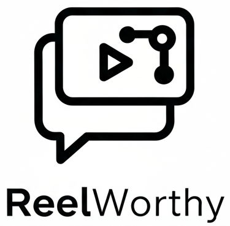

# ReelWorthy User Manual

Welcome to ReelWorthy! This guide will help you understand how to use ReelWorthy to manage, explore, and get intelligent insights from your YouTube playlists, especially your "Watch Later" list.

## Table of Contents

1.  [Introduction](#introduction)
    *   [What is ReelWorthy?](#what-is-reelworthy)
    *   [Key Features](#key-features)
2.  [Getting Started](#getting-started)
    *   [Accessing ReelWorthy](#accessing-reelworthy)
    *   [Logging In](#logging-in)
3.  [Connecting Your YouTube Account](#connecting-your-youtube-account)
4.  [Navigating ReelWorthy](#navigating-reelworthy)
    *   [Main Screens](#main-screens)
    *   [Bottom Navigation Bar](#bottom-navigation-bar)
5.  [Using Your Playlists](#using-your-playlists)
    *   [Viewing Playlists](#viewing-playlists)
    *   [Selecting a Playlist for AI Chat](#selecting-a-playlist-for-ai-chat)
6.  [Chatting with the AI](#chatting-with-the-ai)
    *   [The Chat Interface](#the-chat-interface)
    *   [How the AI Works](#how-the-ai-works)
    *   [Example Queries](#example-queries)
    *   [Understanding AI Responses](#understanding-ai-responses)
7.  [Settings](#settings)
    *   [AI Model Selection](#ai-model-selection)
    *   [Default Playlist](#default-playlist)
    *   [Include Subscription Feed](#include-subscription-feed)
    *   [Logout](#logout)
8.  [Data Synchronization](#data-synchronization)
9.  [Troubleshooting & FAQ](#troubleshooting--faq)

---

## 1. Introduction

### What is ReelWorthy?

ReelWorthy is a smart web application designed to help you make the most of your YouTube playlists. If you have a long "Watch Later" list or many saved playlists, ReelWorthy provides an interactive way to rediscover and engage with your saved video content using a powerful AI chat interface. Furthermore, you can optionally expand the AI's knowledge base to include recent videos from your YouTube channel subscriptions, offering an even broader range of suggestions.

### Key Features

*   **Connect Your YouTube Account:** Securely link your YouTube account to access your playlists.
*   **View & Manage Playlists:** See all your YouTube playlists in one place.
*   **AI-Powered Chat:** Get video suggestions and discuss the content of your playlists with an intelligent AI.
*   **Subscription Feed Integration:** Optionally include recent videos from your YouTube subscriptions in AI suggestions.
*   **Personalized Experience:** The AI tailors suggestions based on the content of your selected playlist and preferences.

---

## 2. Getting Started

### Accessing ReelWorthy

To use ReelWorthy, you'll typically access it through a web browser by navigating to its specific URL (e.g., `https://your-reelworthy-app-url.web.app`).

### Logging In

1.  **Login Prompt:** When you first visit ReelWorthy, you'll be prompted to log in.
    <!-- Placeholder for a generic login screen image if RW01/02/03 show this -->
2.  **Google Sign-In:** ReelWorthy uses your Google Account for a secure and easy login experience. Click the "Sign in with Google" (or similar) button.
3.  **Authorization:**
    *   For new users, your email address might need to be on an approved list to use the application. If you encounter issues, please contact the application administrator.
    *   Once logged in, the app will check if your YouTube account is connected.

---

## 3. Connecting Your YouTube Account

To get the most out of ReelWorthy, you need to connect your YouTube account. This allows the application to access your playlists and provide relevant AI-powered insights.

1.  **Connection Prompt:** If your YouTube account isn't linked after logging in, you'll see a prompt like "Connect YouTube Account."
    <!-- Placeholder: Screenshot of the "Connect YouTube Account" prompt -->
    Image: Connect YouTube Prompt

2.  **Initiate OAuth Flow:** Click the "Connect YouTube Account" button.
3.  **Google Consent Screen:** You'll be redirected to Google's standard account permission screen.
    *   ReelWorthy will request `youtube.readonly` permission. This means the app can **only view** your YouTube playlists and related data. It **cannot** make any changes, delete videos, or modify your YouTube account in any way.
    *   Grant permission to proceed.
4.  **Redirection & Confirmation:** After granting permission, Google will redirect you back to ReelWorthy. The application will confirm the connection.

---

## 4. Navigating ReelWorthy

ReelWorthy has a simple and intuitive interface.

### Main Screens

*   **Playlists Screen:** Displays all your YouTube playlists. This is often the first screen you see after logging in and connecting your YouTube account.
*   **Chat Screen:** Where you interact with the AI to get video suggestions based on a selected playlist.
    *   **Settings Screen:** Manage application preferences, such as AI model selection and subscription feed integration.
    <!-- The Settings icon is a Gear Icon as described by BottomNavigationBar.js. A full screenshot of the settings screen might be one of RW01/02/03 if not used elsewhere, or this can just refer to the icon. -->
    Image: Settings Icon (Gear Icon, as part of the navigation)

### Bottom Navigation Bar

At the bottom of the screen, you'll find a navigation bar to easily switch between the main sections:
*    **Playlists:** Takes you to the Playlists Screen.
*    **Chat:** Takes you to the Chat Screen (usually active after selecting a playlist).
*    **Settings:** Takes you to the Settings Screen.

<!-- Placeholder: General screenshot of the app interface showing the bottom navigation bar -->
Image: Application Interface with Navigation

---

## 5. Using Your Playlists

### Viewing Playlists

*   Once your YouTube account is connected, the Playlists Screen will show a list of your playlists.
*   Each playlist entry typically displays:
    *   Playlist Title
    *   Thumbnail Image
    *   Number of videos in the playlist
*   Your "Watch Later" playlist will be listed here as well.

<!-- Placeholder: Screenshot of the Playlists Screen -->
Image: Playlists Screen

### Selecting a Playlist for AI Chat

1.  **Choose a Playlist:** Tap on any playlist from the list.
2.  **Data Synchronization:** When you select a playlist, ReelWorthy fetches the latest video information for that playlist from YouTube and updates its own records. This ensures the AI has the most current context. This might take a few moments.
3.  **Navigate to Chat:** After the sync is complete, you'll usually be taken to the Chat Screen, ready to discuss the selected playlist with the AI.

---

## 6. Chatting with the AI

This is where ReelWorthy shines! You can have a conversation with an AI to get video suggestions from your selected playlist.

### The Chat Interface

*   **Input Field:** At the bottom of the Chat Screen, there's a text box where you can type your questions or requests for the AI.
*   **Send Button:** After typing your query, tap the send button.

### How the AI Works

*   **Playlist Context:** The AI's primary knowledge comes from the videos within the playlist you currently have selected.
*   **Subscription Feed (Optional):** If you enable "Include Subscription Feed" in Settings, the AI will also consider recent (non-Shorts) videos from your YouTube channel subscriptions. This can broaden the range of suggestions.
*   **JSON Output:** The AI is designed to provide suggestions in a structured format, which the app then displays clearly.

### Example Queries

You can ask things like:

*   "Show me short comedy videos I haven't finished."
*   "What videos are about learning to code?"
*   "Suggest some relaxing music videos from this playlist."
*   "Find videos longer than 20 minutes on topic X."

### Understanding AI Responses

1.  **"Thinking..."**: While the AI processes your query, you might see a "thinking" or streaming indicator.
2.  **Suggested Videos:** The AI will respond with a list of suggested videos. Each suggestion usually includes:
    *   Video Title (and possibly thumbnail)
    *   A brief reason why the AI suggested that video based on your query.
3.  **Interacting with Suggestions:** You can typically click on a suggested video to open it on YouTube.

<!-- Placeholder: Screenshot of the Chat Screen with AI suggestions -->
Image: Chat Screen with AI Suggestions

---

## 7. Settings

Access the Settings screen to customize your ReelWorthy experience. You can find the Settings option via the  **Settings Icon** in the bottom navigation bar.

### AI Model Selection
*   **Dropdown Menu:** You can choose your preferred AI model for chat interactions from a dropdown menu labeled "Select AI Chat Model:".
*   If models are loading or unavailable, this might be indicated in the dropdown.

### Default Playlist
*   **Checkbox:** You can opt to "Automatically load a default playlist on startup" by checking the corresponding box.
*   **Playlist Selection:** If you enable this, a dropdown menu will allow you to select one of your existing playlists as the default. This playlist will be automatically selected when you start the application.
*   This preference is saved in your browser.

### Include Subscription Feed
*   **Checkbox:** You'll find a checkbox labeled "Include recent videos from my subscriptions in AI suggestions".
*   **Functionality:**
    *   **Off:** The AI will only use videos from your currently selected playlist for suggestions.
    *   **On:** The AI will use videos from your selected playlist AND the 100 most recent non-Short videos from your YouTube channel subscriptions.
*   **Impact:** Turning this on can give you a wider variety of suggestions, especially if your selected playlist is small or very specific. This preference is saved in your browser.
*   **Note:** Changing this setting will reset your current chat session so the AI can use the new context.

### Logout
*   **Button:** A "Logout" button is available on the Settings screen to sign you out of ReelWorthy.

---

## 8. Data Synchronization

ReelWorthy keeps its information about your playlists and videos up-to-date through synchronization processes.

*   **Playlist Sync (On-Demand):**
    *   **When:** Occurs when you select a playlist for the first time or manually trigger a refresh (if this option is available).
    *   **What:** Fetches the current list of videos and their details from the selected YouTube playlist and stores/updates them in ReelWorthy's database.
*   **User Subscription Feed Sync (Background & On-Demand):**
    *   **Scheduled:** Runs automatically twice a day (e.g., 3 AM and 3 PM UTC) to update the cached list of recent videos from your subscriptions for all users.
    *   **On-Demand/Initial:**
        *   When you first successfully link your YouTube account.
        *   If the app detects your subscription feed cache isn't ready when you log in.
    *   **What:** Fetches up to 10 recent videos from each of your subscribed channels, selects the top 100 newest overall, filters out Shorts (videos ~60 seconds or less), and stores their details.
*   **Why it's important:** This ensures the AI has fresh and relevant video information to provide you with the best possible suggestions.

---

## 9. Troubleshooting & FAQ

*   **Q: I can't log in or access the app.**
    *   A: Ensure you are using the correct Google Account. For some versions of ReelWorthy, your email address may need to be on an pre-approved allow-list. Contact the application administrator if you believe this is the issue.

*   **Q: My YouTube account connection failed.**
    *   A: Double-check your internet connection. Ensure pop-up blockers are not interfering with the Google OAuth window. Try the connection process again.

*   **Q: The AI's video suggestions seem irrelevant.**
    *   A:
        *   Try rephrasing your query to be more specific or clearer.
        *   Ensure you have the correct playlist selected for the context you want.
        *   Check your "Include Subscription Feed" setting. If it's on, suggestions might come from your broader subscriptions. If it's off, they'll only be from the playlist.
        *   Allow some time for data synchronization if you've recently made many changes to your YouTube playlists.

*   **Q: How does ReelWorthy protect my YouTube data?**
    *   A: ReelWorthy requests `youtube.readonly` permission, meaning it can only view your playlist and video information. It cannot make any changes to your YouTube account. Your YouTube credentials (like passwords) are never accessed or stored by ReelWorthy; authentication is handled securely by Google.

---

We hope this manual helps you enjoy using ReelWorthy!
